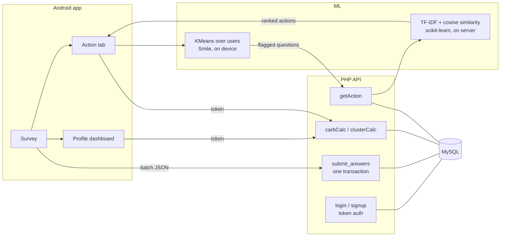

# Carbon Footprint Analyser

An Android app that estimates your personal carbon footprint from a lifestyle survey, visualizes where your emissions come from, and recommends practical actions to reduce them — powered by a machine-learning recommender that compares you against other users.

Built as a BSc final-year project, around Malaysian consumption patterns (local grid emission factors, RM-based spending brackets, and the national average footprint of 10.158 tCO2e as a benchmark).


## Features

- **Secure accounts** — password hashing (bcrypt) on the server, token-based API authentication, and client-side input validation.
- **Lifestyle survey** — 17 questions across home energy, food & waste, and transportation, submitted in a single transactional batch.
- **Footprint dashboard** — your yearly tCO2e total, broken down into electricity, fuel, and waste on an animated pie chart, with the Malaysian average for comparison.
- **Personalized recommendations** — users are clustered by their survey answers (KMeans); the questions your cluster performs worst on are identified and matched to a database of 90 reduction actions by a TF-IDF + cosine-similarity recommender.
- **Eco facts** — curated facts, quotes, and videos about sustainable living.

## How it works



1. **Calculate** — survey answers for energy, waste, and fuel are converted to kg CO2e using published emission factors (0.758 kg/kWh electricity, 2.345 kg/L petrol, 0.497 kg/kg waste).
2. **Cluster** — every user's 17 answers form a vector; KMeans groups users into three behavioural clusters, and the app identifies which questions *your* cluster answers most carbon-intensively.
3. **Recommend** — those flagged questions are sent to a Python recommender that clusters the action catalogue per category (TF-IDF), then ranks actions in the question's predicted cluster by cosine similarity. Output is deterministic, deduplicated JSON.

## Tech stack

| Layer | Technology |
|---|---|
| Mobile app | Java, AndroidX, Material Components, MPAndroidChart, Smile (KMeans) |
| API | PHP 8 + MySQL (mysqli, prepared statements, token auth) |
| Recommender | Python 3, scikit-learn, NumPy |
| Testing | JUnit 4 unit tests for the footprint calculator |

## Getting started

### Prerequisites

- Android Studio (Android SDK 21+)
- A PHP + MySQL server, e.g. [XAMPP](https://www.apachefriends.org/)
- Python 3 with `scikit-learn` and `numpy` available to the web server

### 1. Set up the backend

1. Copy the `Database/` folder into your web root (e.g. `htdocs/CarbonFootprintFYP/`).
2. Import `Database/finalDB_carbonfootprint.sql` into MySQL to create the `carbonfootprint` database.
   Upgrading an existing database instead? Run `Database/migrations/001_add_api_token.sql`.
3. Set your MySQL credentials in `Database/DataBaseConfig.php`.

### 2. Point the app at your server

Edit `BASE_URL` in [`ApiConfig.java`](app/src/main/java/com/example/carbonfootprint/ApiConfig.java) to your machine's LAN IP:

```java
public static final String BASE_URL = "http://192.168.x.x/CarbonFootprintFYP/";
```

### 3. Run

Open the project in Android Studio, sync Gradle, and run on an emulator or a device on the same network. Sign up, complete the survey, and the Profile and Action tabs will populate.

## API overview

All data endpoints require the token issued by `login.php` and resolve the user server-side from it.

| Endpoint | Method | Purpose |
|---|---|---|
| `signup.php` | POST | Create an account (password stored as a bcrypt hash) |
| `login.php` | POST | Verify credentials; returns `{userId, token, needsSurvey}` |
| `submit_answers.php` | POST | Save all 17 survey answers in one transaction |
| `carbCalc.php` | GET | The caller's footprint-relevant answers |
| `clusterCalc.php` | GET | Anonymized answer matrix for clustering |
| `getAction.php` | GET | Run the recommender for the flagged questions |

> **Note** — traffic is plain HTTP intended for a local development network. Put the backend behind HTTPS before using it outside a lab setup.

## Testing

Unit tests cover the emission calculator (per-question factors, category breakdown, out-of-range inputs):

```
./gradlew test
```

## Project structure

```
app/src/main/java/com/example/carbonfootprint/
├── Login / SignUp / Survey        # onboarding flow
├── MainPage                       # bottom-nav host (Profile · Action · Facts)
├── CarbonCalculator               # emission factors and footprint breakdown
├── ClusterAnalysis                # flags the user's weakest survey areas
├── ApiConfig / Session            # backend location and auth state
Database/
├── *.php                          # API endpoints + shared auth helper
├── clusterAction.py               # TF-IDF + cosine-similarity recommender
├── finalDB_carbonfootprint.sql    # schema and seed data
└── migrations/                    # incremental schema changes
```

## Author

**Ooi Yeuan Yang** — BSc final-year project.

Contributions and suggestions are welcome — feel free to open an issue or pull request.

## Acknowledgments

Special thanks to Dr Zila and Dr Safwan, who provided insights and verified the information presented in the app.
